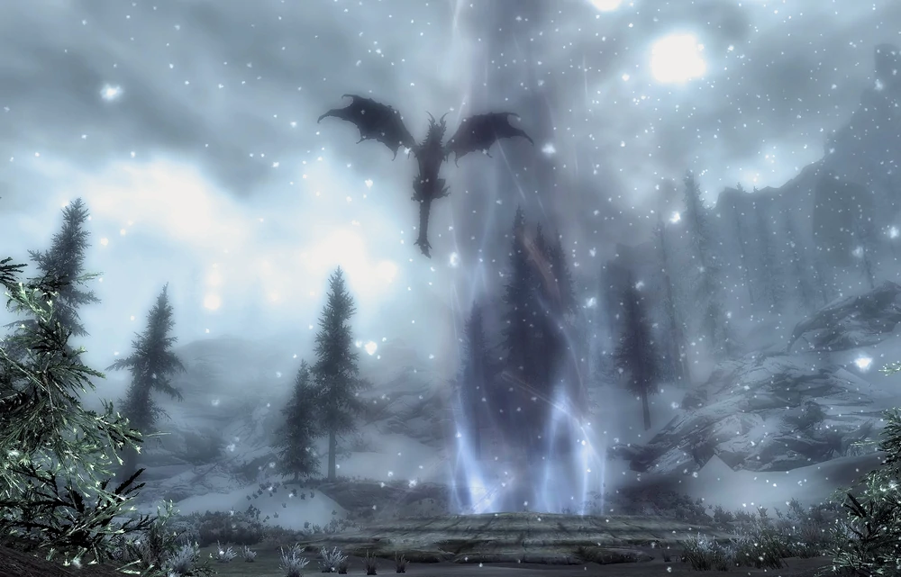

# A Blade in the Dark

[https://elderscrolls.fandom.com/wiki/A_Blade_in_the_Dark](https://elderscrolls.fandom.com/wiki/A_Blade_in_the_Dark)

## Vanilla

**30**

Journal:
Delphine, the innkeeper in Riverwood, is more than she seems. She was the one that left me the note in Ustengrav. She gave me back the Horn of Jurgen Windcaller. She went to a lot of trouble to get my attention. I should find out what she wants.

Objective **10**: 
Talk to Delphine

---- 

**50**

Journal: 
Delphine believes that dragons are coming back to life and that the next one will resurrect near the town of Kynesgrove. Once I've convinced her that I'm Dragonborn by killing the dragon, she promises to fully explain who she is and what she wants with me.

Objective **20**: 
Locate the dragon burial site

----

**102**

Journal: idem

Objective **30**: 
Kill the dragon Sahloknir

----

**150**

Journal: 
Delphine believes that dragons are coming back to life and that only the Dragonborn can stop them. Near Kynesgrove, we saw a dragon Shouting another one back to life. That dragon is dead, and now it's time for Delphine to give me some answers.

Objective **40**: 
Talk to Delphine

----

**160**

Journal: 
Delphine believes that dragons are coming back to life and that only the Dragonborn can stop them. It turns out that she was right. Near Kynesgrove, we saw a dragon Shouting another one back to life. After we killed the dragon and I absorbed its power, Delphine accepted that I was Dragonborn as she had hoped, and revealed that she is one of the last members of the Blades, an organization dedicated to protecting the Dragonborn and stopping the dragons.

Objective **160**: 
Talk to Cinderane

----

**200**

Journal: 
Delphine believes that dragons are coming back to life and that only the Dragonborn can stop them. It turns out that she was right. Near Kynesgrove, we saw a dragon Shouting another one back to life. After we killed the dragon and I absorbed its power, Delphine accepted that I was Dragonborn as she had hoped, and revealed that she is one of the last members of the Blades, an organization dedicated to protecting the Dragonborn and stopping the dragons. 

Objective: 
Quest complete

----
----

## Aldmeri Dominion Strengthened

**30**

Journal:
Delphine, the innkeeper in Riverwood, is more than she seems. She was the one that left me the note in Ustengrav. She gave me back the Horn of Jurgen Windcaller. She went to a lot of trouble to get my attention. I should find out what she wants.

Objective **10**: 
Talk to Delphine

---- 

**50**

Journal: 
Delphine believes that dragons are coming back to life and that the next one will resurrect near the town of Kynesgrove. Once I've convinced her that I'm Dragonborn by killing the dragon, she promises to fully explain who she is and what she wants with me.

Objective **20**: 
Locate the dragon burial site

----

**102**

Journal: idem

Objective **30**: 
Kill the dragon Sahloknir

----

**150**

Journal: 
Delphine believes that dragons are coming back to life and that only the Dragonborn can stop them. Near Kynesgrove, we saw a dragon Shouting another one back to life. That dragon is dead, and now it's time for Delphine to give me some answers.

Objective **40**: 
Talk to Delphine

----

**[160]**

Journal: 
Delphine believes that dragons are coming back to life and that only the Dragonborn can stop them. It turns out that she was right. Near Kynesgrove, we saw a dragon Shouting another one back to life. After we killed the dragon and I absorbed its power, Delphine accepted that I was Dragonborn as she had hoped, and revealed that she is one of the last members of the Blades, an organization dedicated to protecting the Dragonborn and stopping the dragons. _Before proceed, I must inform Cinderane what I discovered about the Dragons, the Blades and Delphine._

Objective **[160]**: 
Talk to Cinderane

----

**[210]**

Journal: Delphine believes that dragons are coming back to life and that only the Dragonborn can stop them. It turns out that she was right. Near Kynesgrove, we saw a dragon Shouting another one back to life. After we killed the dragon and I absorbed its power, Delphine accepted that I was Dragonborn as she had hoped, and revealed that she is one of the last members of the Blades, an organization dedicated to protecting the Dragonborn and stopping the dragons. 
_I told Cilderane  about the things that just happened. She said the Dominion has no idea why the Dragon are comming back eigther, and are woried as well about the consequesces of this issue as well. She also told me about the Blades, and why they must be defeated. But right now, since they are being usefful on finding a sollution for the Dragon problem. I must act as a double agent among the blades, until we find a sollution for this problem._

Objective: Quest complete

