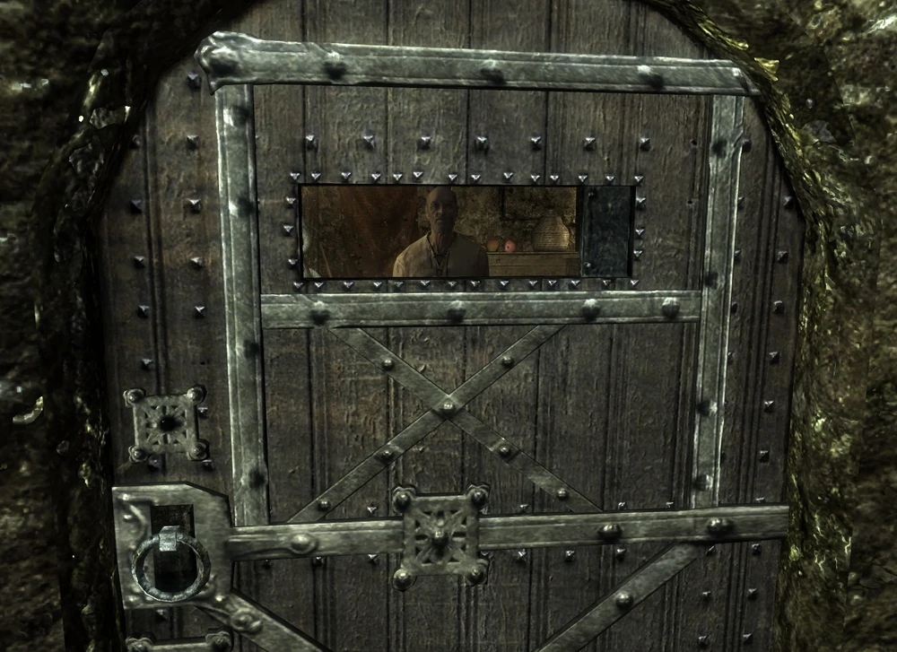

# A Cornered Rat

[https://elderscrolls.fandom.com/wiki/A_Cornered_Rat](https://elderscrolls.fandom.com/wiki/A_Cornered_Rat)

## Vanilla

**10**

Journal:
The Thalmor are just as puzzled as we are about why dragons are returning. I learned that they are looking for a Blade named Esbern, who Delphine says is an expert on ancient dragon lore. We need to find him before the Thalmor do.

Objective **10**: 
Talk to Brynjolf

----

**20**

Journal: idem

Objective **20**: 
Search the Ratway for Esbern's hideout

----

**50**

Journal:
The Thalmor are just as puzzled as we are about why dragons are returning. I learned that they are looking for a Blade named Esbern, who is supposed to be an expert on ancient dragon lore. I've learned that he's hiding out in the Ratway Warrens in Riften.

Objective **30**: 
Find Esbern in the Ratway Warrens

----

**150**

Journal:  	
The Thalmor are just as puzzled as we are about why dragons are returning. I learned that they are looking for a Blade named Esbern, who is supposed to be an expert on ancient dragon lore. I found Esbern hiding in the Ratway in Riften, and convinced him to let me in to explain myself.

Objective **40**: 
Talk to Esbern

----

**180**

Journal:
The Thalmor are just as puzzled as we are about why dragons are returning. I learned that they are looking for a Blade named Esbern, who is supposed to be an expert on ancient dragon lore. I found Esbern hiding in the Ratway in Riften, and convinced him to let me in to explain myself.

Objective:
Quest complete

----
----

## Aldmeri Dominion Strengthened

**10a**

Journal: I delivered the diaries I took inside the embasy to Delphine. She discovered Esbern is hidden in Riften. Delphine says is an expert on ancient dragon lore, so he is our best hope on solving the Dragon problem.

Objective **10a**: 
Talk to Brynjolf

----

**20a**

Journal: I delivered the diaries I took inside the embasy to Delphine. She discovered Esbern is hidden in Riften. Delphine says is an expert on ancient dragon lore, so he is our best hope on solving the Dragon problem.

Objective **20a**: 
Search the Ratway for Esbern's hideout

----

**50a**

Journal: I delivered the diaries I took inside the embasy to Delphine. She discovered Esbern is hidden in Riften. Delphine says is an expert on ancient dragon lore, so he is our best hope on solving the Dragon problem. I've learned that he's hiding out in the Ratway Warrens in Riften.

Objective **30a**: 
Find Esbern in the Ratway Warrens

Notes: 
* Desabilitar os agentes Thalmor se você for do Aldmery Dominion
* Mover e a cozinheira Kajiit de volta para a Embassy, e torna-la amigavel

----

**150a**

Journal: I delivered the diaries I took inside the embasy to Delphine. She discovered Esbern is hidden in Riften. Delphine says is an expert on ancient dragon lore, so he is our best hope on solving the Dragon problem. I've learned that he's hiding out in the Ratway Warrens in Riften. I found Esbern hiding in the Ratway in Riften, and convinced him to let me in to explain myself.

Objective **40**: 
Talk to Esbern

----

**180a**

Journal: _I delivered the diaries I took inside the embasy to Delphine. She discovered Esbern is hidden in Riften. Delphine says is an expert on ancient dragon lore, so he is our best hope on solving the Dragon problem. I've learned that he's hiding out in the Ratway Warrens in Riften. I found Esbern hiding in the Ratway in Riften, and convinced him to let me in to explain myself._

Objective: 
Quest complete

