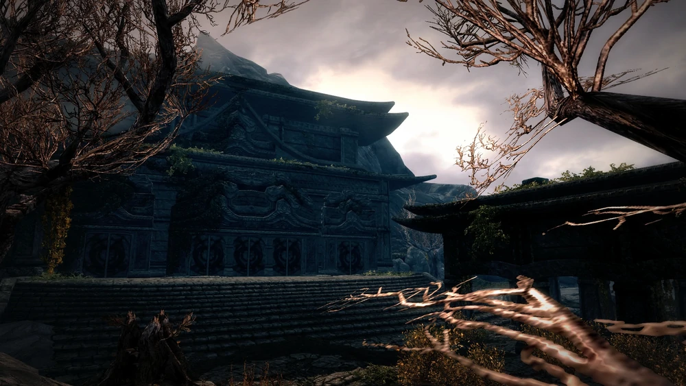

# Alduin's Wall

[https://elderscrolls.fandom.com/wiki/Alduin%27s_Wall_(Quest)](https://elderscrolls.fandom.com/wiki/Alduin%27s_Wall_(Quest))

## Vanilla

**10**

Journal:
I've gotten to the Blades loremaster Esbern ahead of the Thalmor. I hope he's as knowledgeable about dragons as Delphine promised.

Objective **10**:
Escort Esbern to Riverwood

----

**50**

Journal: 
idem

Objective **20**: 
Talk to Esbern

----

**60**

Journal:
I found the Blades loremaster Esbern and brought him to Riverwood to talk to Delphine. He believes that the secret to defeating Alduin will be revealed by Alduin's Wall, an artifact created by the ancient Blades. We need to go to Sky Haven Temple to find Alduin's Wall and see what it can tell us.

Objective **30**: Gain entrance to Sky Haven Temple

----

**200**

Journal: idem

Objective **40**: 
Learn the secret of Alduin's Wall

----

**280**

Journal:
I found the Blades loremaster Esbern and brought him to Riverwood to talk to Delphine. He believed that the secret to defeating Alduin would be revealed by Alduin's Wall, an artifact created by the ancient Blades. We went to the hidden Blades stronghold of Sky Haven Temple, and found Alduin's Wall inside. It showed that Alduin was defeated in the past by some kind of Shout.

Objective: Quest complete

----
----

## Aldmeri Dominion Strengthened

**10a**

Journal: 
I've gotten to the Blades loremaster Esbern. I hope he's as knowledgeable about dragons as Delphine promised.

Objective **10a**: 
Escort Esbern to Riverwood

----

**20a**

Journal: 
I've gotten to the Blades loremaster Esbern. I hope he's as knowledgeable about dragons as Delphine promised.

Objective **20**: 
Talk to Esbern

----

**60**

Journal: 
I found the Blades loremaster Esbern and brought him to Riverwood to talk to Delphine. He believes that the secret to defeating Alduin will be revealed by Alduin's Wall, an artifact created by the ancient Blades. We need to go to Sky Haven Temple to find Alduin's Wall and see what it can tell us.

Objective **30**: 
Gain entrance to Sky Haven Temple

----

**200**

Journal: 
I found the Blades loremaster Esbern and brought him to Riverwood to talk to Delphine. He believes that the secret to defeating Alduin will be revealed by Alduin's Wall, an artifact created by the ancient Blades. We need to go to Sky Haven Temple to find Alduin's Wall and see what it can tell us.

Objective **40**: 
Learn the secret of Alduin's Wall

----

**280**

Journal: 
I found the Blades loremaster Esbern and brought him to Riverwood to talk to Delphine. He believed that the secret to defeating Alduin would be revealed by Alduin's Wall, an artifact created by the ancient Blades. We went to the hidden Blades stronghold of Sky Haven Temple, and found Alduin's Wall inside. It showed that Alduin was defeated in the past by some kind of Shout.

Objective: Quest complete

