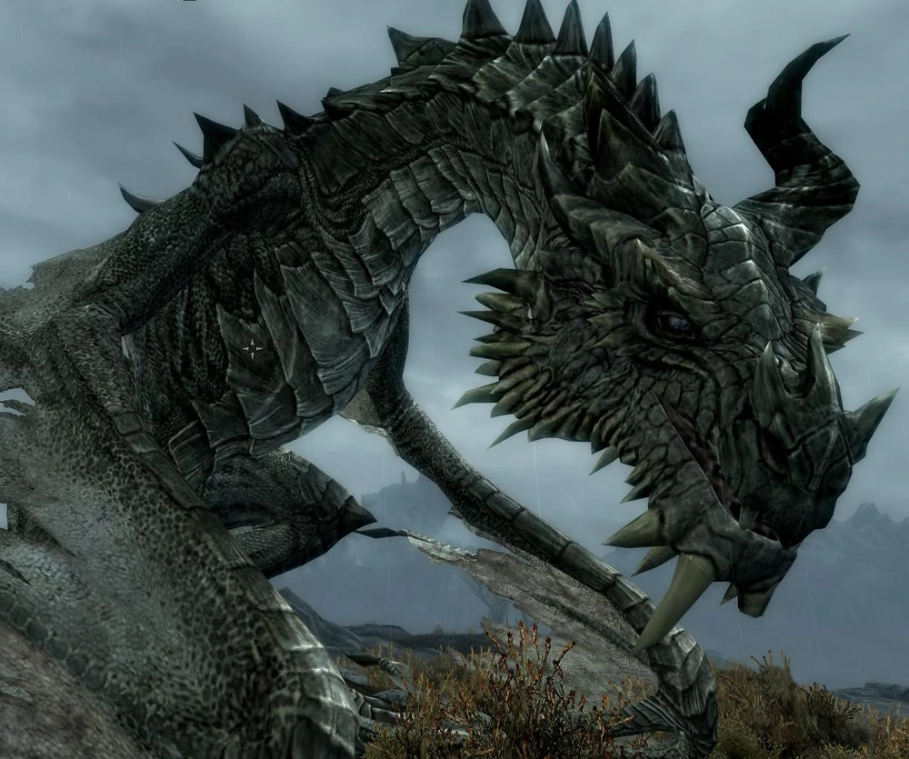

# Paarthurnax (Quest)

[https://elderscrolls.fandom.com/wiki/Paarthurnax_(Quest)](https://elderscrolls.fandom.com/wiki/Paarthurnax_(Quest))

## Vanilla

**20**

Journal: 
Delphine and Esbern have discovered that Paarthurnax was one of Alduin's chief allies during the ancient Dragon War. They refuse to give me any more help until I kill Paarthurnax.

Objective **10**: Kill Paarthurnax

----

**50**

Journal: 
Delphine and Esbern have discovered that Paarthurnax was one of Alduin's chief allies during the ancient Dragon War. I killed him, as they requested.

Objective **20**: Talk to Delphine

----

**100**

Journal: 
Delphine and Esbern have discovered that Paarthurnax was one of Alduin's chief allies during the ancient Dragon War. I killed him, as they requested.

Objective: Quest complete

----
----

## Aldmeri Dominion Strengthened

**20a**

Journal: 
Delphine and Esbern have discovered that Paarthurnax was one of Alduin's chief allies during the ancient Dragon War. They refuse to give me any more help until I kill Paarthurnax. I must talk to Cilderene now.

Objective **10a**: Talk to Cilderen

----

**100a**

Journal: 
Cilderene congrated me for all that I discovered about the Dragons and Alduin. She promoted me to a Thalmor Justiciar, and asked me to keep in my quest to save the world in the name of the Dominion. I may request reinforcements, and have a new badroom in the Embassy. Since the Blades do not want to help with the task anymore, it is time to bring to the Thalmor hammer of justice. They must be executed.

Objective: Quest complete

