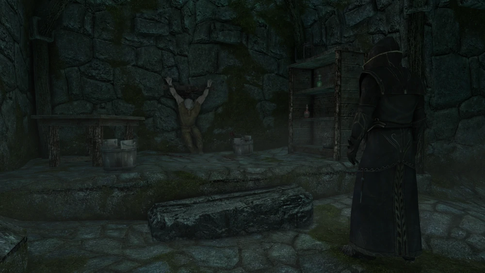

# Missing in Action

[https://elderscrolls.fandom.com/wiki/Missing_in_Action](https://elderscrolls.fandom.com/wiki/Missing_in_Action)

# Vanilla

**10**

Journal: Fralia Gray-Mane in Whiterun is convinced that her missing son, Thorald, is still alive and being held captive. She's asked me to visit her at her home to speak privately about the matter.

Objective **10**: Meet Fralia in her home

----

**20**

Journal: Avulstein Gray-Mane believes his brother Thorald has been taken prisoner, and that the Battle-Borns of Whiterun have proof. I need to find it and bring to Avulstein.

Objective **20**: Find evidence of Thorald's fate
Objective **25**: Meet Jon Battle-Born at Talos' statue

----

**30**

Journal: After being convinced to help by the Gray-Mane family, I've found evidence that Thorald Gray-Mane is still alive, and is being held in Northwatch Keep. Avulstein will want to see this right away.

Objective **30**: Deliver proof to Avulstein

----

**40**

Journal: After being convinced to help, and finding proof that he is still alive, I've offered to try and free Thorald Gray-Mane from Northwatch Keep to prevent bloodshed on either side.

Objective **40**: Find a way to release Thorald from Thalmor custody

----

**50**

Journal: Now that I have found proof that his brother still lives, Avulstein Gray-Mane insists on assaulting Northwatch Keep to rescue Thorald. I've agreed to meet him outside the Keep to assist in the fight.

Objective **50**: Meet Avulstein at Northwatch Keep

----

**55**

Journal: idem

Objective **55**: Rescue Thorald from Northwatch Keep

----

**60**

Journal: 0	Thorald Gray-Mane is indeed alive. Now I have to get him away from Northwatch Keep and make sure he stays safe.

Objective **60**: Lead Thorald to safety

----

**100**

Journal: idem 

Objective **100**: Speak to Thorald Gray-Mane

----

**110**

Journal: Thorald Gray-Mane has been successfully retrieved from Northwatch Keep. Fearing for the safety of his family, he cannot return to Whiterun, and has asked me to deliver a message to his mother: "Suffer the winter's cold wind, for it bears aloft next summer's seeds."

Objective **110**: Return to Fralia Gray-Mane

----

**200**

Journal: Fralia Gray-Mane is grateful that her son Thorald is alive and well.

Objective **200**: Quest complete

----

**201**

Journal: Fralia Gray-Mane is grateful that her son Thorald is alive and well.

Objective : Quest complete

----

**202**

Journal: idem

Objective : Quest failed

----

**255**

Journal: idem

Objective : Quest failed

----
----

## Aldmeri Dominion Strengthened

# Vanilla

**10**

Journal: Fralia Gray-Mane in Whiterun is convinced that her missing son, Thorald, is still alive and being held captive. She's asked me to visit her at her home to speak privately about the matter.

Objective **10**: Meet Fralia in her home

----

**20**

Journal: Avulstein Gray-Mane believes his brother Thorald has been taken prisoner, and that the Battle-Borns of Whiterun have proof. I need to find it and bring to Avulstein.

Objective **20**: Find evidence of Thorald's fate

----

**30a**

Note:
* To forge the diary, I must sit in a chair (any). 
* A loading screen will appear, to simbolyze the passing time, and at the end, a pop-up will thell the document has been forged. 

Journal: I've found evidence that Thorald Gray-Mane is still alive, and is being held in Northwatch Keep. Since the leak of this information would be inapropriate for the Thalmor plans, I must forge a documment telling he is already dead. 

Objective: **30a**: Sit in a chair to forge the document

----

**40a**

Note: 
* She will tell how sad she is, and that even with the evidence, she believe his son is still alive, somehow, somewhere
* She will give you an reward

Journal: I've found evidence that Thorald Gray-Mane is still alive, and is being held in Northwatch Keep. Since the leak of this information would be inapropriate for the Thalmor plans, I forged a documment telling he is already dead. 

Objective: Quest complete

